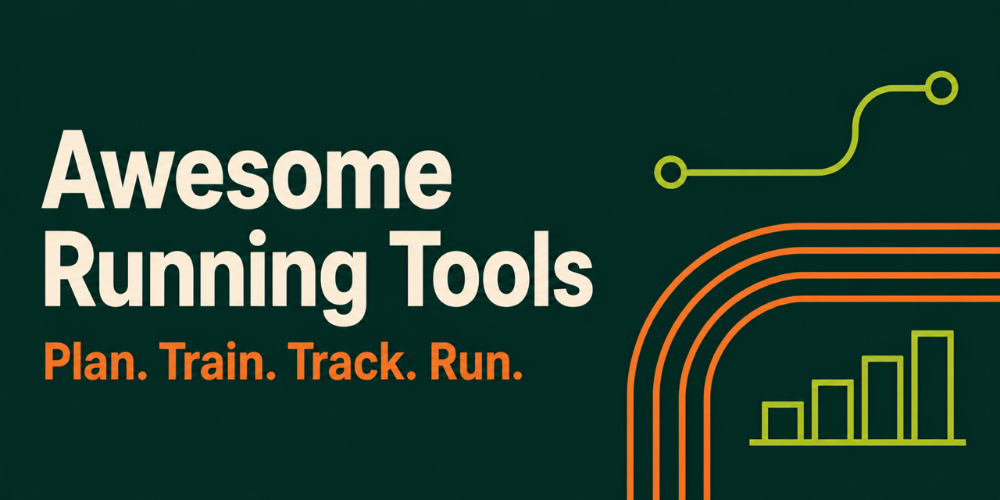

#  

Recreational and competitive distance running.

## Contents

- [Training and Planning](#training-and-planning)
- [Performance Tracking](#performance-tracking)
- [Route Planning](#route-planning)
- [Race Discovery and Registration](#race-discovery-and-registration)
- [Conditions, Nutrition, and Gear](#conditions-nutrition-and-gear)
- [Motivation and Community](#motivation-and-community)

## Training and Planning

- [intervals.icu](https://intervals.icu) - Free advanced training-analysis platform for runners and cyclists, with fitness/fatigue tracking and workout planning.
- [Runkeeper](https://runkeeper.com/) - Training plans, goal setting, and progress tracking from ASICS.
- [Runna](https://www.runna.com/) - Personalized running training plans and coaching for runners of all levels, with plans for races and distances from 5K to ultramarathon.
- [DialPace](https://dialpace.com/) - Free running pace calculators: race pace, time prediction, VDOT training zones, splits, and printable pace bands.
- [Nike Run Club](https://www.nike.com/nrc-app) - GPS run tracking, guided runs, and coaching plans.
- [Zwift Run](https://zwift.com/run) - Virtual treadmill workouts, group runs, and races.
- [Couch to 5K](https://www.c25kfree.com/) - Beginner training program for progressing from run-walk intervals to a first 5K.
- [VDOT O2 Running Calculator](https://vdoto2.com/calculator/) - Training pace and race-performance calculator based on VDOT.
- [McMillan Running Calculator](https://www.mcmillanrunning.com/) - Training pace and race-time calculator.
- [Pace Playground](https://www.defy.org/hacks/paceplayground/) - Interactive pace calculator for training and race strategy.

## Performance Tracking

- [Garmin Connect](https://connect.garmin.com/) - Run analysis, progress tracking, and challenges for Garmin devices.
- [Strava](https://www.strava.com/) - Run tracking, performance analysis, route planning, and athlete clubs.
- [MapMyRun](https://www.mapmyrun.com/) - Run tracking, performance analysis, goals, and route discovery.

## Route Planning

- [Plotaroute](https://www.plotaroute.com/) - Route planning, sharing, and discovery with detailed mapping tools.
- [Komoot](https://www.komoot.com/) - Route planning with turn-by-turn navigation and terrain analysis.
- [On The Go Map](https://onthegomap.com/) - Simple route mapping and distance calculation.

## Race Discovery and Registration

- [Race Roster](https://raceroster.com/) - Worldwide race discovery, registration, and event management.
- [RunSignUp](https://runsignup.com/) - US race discovery, registration, fundraising, and event management.
- [World's Marathons](https://worldsmarathons.com/) - International marathon and running-event discovery and registration.
- [Running in the USA](https://www.runningintheusa.com/) - Directory of running races and events across the United States.
- [Find a Race](https://findarace.com/) - UK and international running, triathlon, and obstacle-race discovery.

## Conditions, Nutrition, and Gear

- [AccuWeather Running Forecast](https://www.accuweather.com/en/us/national/running-weather) - Running forecasts for planning around local weather.
- [MyFitnessPal](https://www.myfitnesspal.com/) - Nutrition, hydration, and calorie tracking.
- [RunRepeat](https://runrepeat.com/) - Independent reviews and comparisons of running shoes and gear.

## Motivation and Community

- [parkrun](https://www.parkrun.com/) - Free weekly timed 5K events in parks around the world.
- [Reddit r/running](https://www.reddit.com/r/running/) - Online community for running advice, experiences, and discussion.
- [Wandrer](https://wandrer.earth/) - Street-exploration challenges with activity tracking and achievements.
- [CityStrides](https://citystrides.com/) - Street-by-street running progress with maps and completion statistics.
- [Zombies, Run!](https://zombiesrungame.com/) - Story-driven running missions and interval workouts.

## Contributing

Independent contributions are welcome. Read the [contribution guidelines](CONTRIBUTING.md) before submitting a resource or maintenance change. New resource submissions must not be self-affiliated, paid, automated, or part of bulk promotional outreach. Participation is governed by the [Code of Conduct](CODE_OF_CONDUCT.md).
